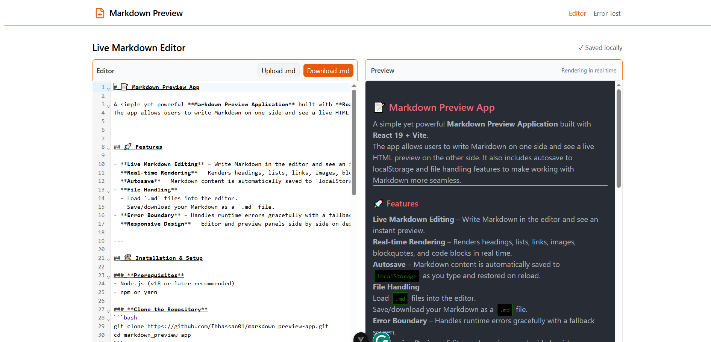

# Markdown Preview App

A simple yet powerful **Markdown Preview Application** built with **React 19 + Vite**.  
The app allows users to write Markdown on one side and see a live HTML preview on the other side. It also includes autosave to localStorage and file handling features to make working with Markdown more seamless.

---

## Features

- **Live Markdown Editing** – Write Markdown in the editor and see an instant preview.
- **Real-time Rendering** – Renders headings, lists, links, images, blockquotes, and code blocks in real time.
- **Autosave** – Markdown content is automatically saved to `localStorage` as you type and restored on reload.
- **File Handling**  
  - Load `.md` files into the editor.  
  - Save/download your Markdown as a `.md` file.
- **Error Boundary** – Handles runtime errors gracefully with a fallback screen.
- **Responsive Design** – Editor and preview panels side by side on desktop, stacked on mobile.

---

## Installation & Setup

### **Prerequisites**
- Node.js (v18 or later recommended)
- npm or yarn

### **Clone the Repository**
```bash
git clone https://github.com/Ibhassan01/markdown_preview-app.git
cd markdown_preview-app
```

### **Install dependencies**
```bash
npm install
```

### **Run the Development Server**
```bash
npm run dev
```
### **Build for Production**
```bash
npm run build
```

---

## Technology Stack and Architecture

- **React 19** with functional components and hooks
- **Vite** for fast development and builds
- **Tailwind** for CSS styling
- **react-markdown** for Markdown parsing and rendering
- **localStorage** for persistence 
-- **ErrorBoundary** for handling errors

---

## Architecture Decisions 
- **Markdown Parsing**: Chose *react-markdown*
 for reliable rendering of common Markdown elements.

- **Autosave**: Implemented via a debounced useEffect that writes to localStorage after 500ms of inactivity.

- **File Handling**: Abstracted into a separate FileHandler component for clean separation of concerns.

---

## Known Issues / Limitations

- No syntax highlighting for code blocks (would require integration with *react-syntax-highlighter*).

- API integration is notimplemented (only localStorage persistence for now).

- Error boundary reloads the app when navigating home — could be enhanced to reset state without full refresh.

- Limited support for advanced Markdown features (tables, footnotes, math).

---

## Future Improvements

- Add syntax highlighting for code blocks in the preview.

- Enable live Markdown linting in the editor.

- Support more advanced Markdown features (tables, task lists, footnotes).

- Implement full API integration for cloud persistence of markdown files.

- Add theme switching (light/dark mode).

- Improve editor experience using Monaco or CodeMirror for syntax highlighting.

--- 

## Screenshots



## 👤 Author

[@Ibhassan01](https://github.com/Ibhassan01)